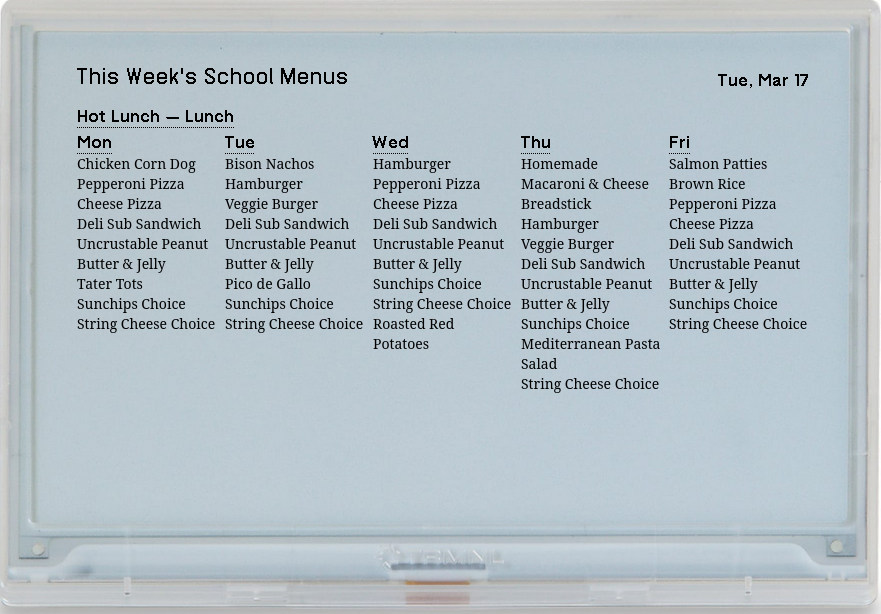
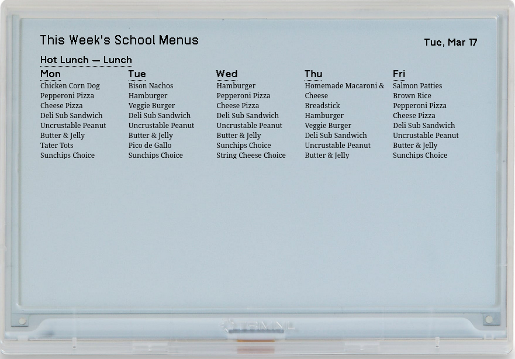
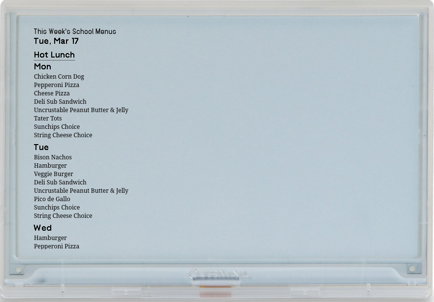
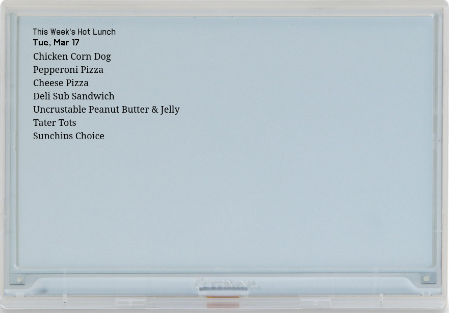

# trmnl-msm

Fetch school lunch menus and display them on TRMNL.

## What it does

This plug-in fetches school menu information from My School Menus ([https://menus.healthepro.com/](https://menus.healthepro.com/)). You can add up to two schools and customize the plug-in to show menu data for the current day, the current and next days, or the entire week.

## Screenshots

### Full Screen

### Half Horizontal

### Half Vertical

### Quadrant

## Pre-Requesites
To install this plug-in through Github, you need the following:

- a TRMNL device
- a Github Account
- Python 3.14 or above

## Setup

### Local Preview

You can run a local preview of your settings to make set up easier. This lets you see a simulated TRMNL device in your browser rather than pushing changes to your physical device and waiting for the long e-ink refresh between every adjustment. Here's how to set up the local preview:

1. Install the trmnlp gem: `gem install trmnl_preview`
2. Run bin/dev to start the preview server at http://localhost:4567
3. Use bin/fetch --date YYYY-MM-DD to simulate different dates

> Note: You won't see anything in the local preview until you finish configuring your district, display, school, and menu settings in config.toml. See below. 

### Setup Options

How to set up depends on whether you are installing through github or through a recipe. For recipes, just fill in the forms for your school district, school, and menu choices. If you are installing from GitHub, follow these steps: 

1. Go to https://menus.healthepro.com/.
2. Enter the name of your school district.
3. Select the school and menu you want to display. 
4. Make a note of the id numbers in the URL. For example, if the url is 

     ` https://menus.healthepro.com/organizations/1252/sites/13192/menus/102650 `

     then `1252` is the district, `13192` is the school, and `102650` is the menu.

### Configure

You will configure the settings you want by creating a file in the project root folder called config.toml and editing it. Follow these steps:

1. Make a copy of config.example.toml and save it as config.toml.
2. Open config.toml in your text editor and fill in the information that gathered during the setup phase:

     1. Set organization_id to your district id (1252 in our example).
     2. Set your display mode: "today", "today_tomorrow", or "week".  
     3. Create an [[msm.menus]] block for each menu that you want displayed. Fill is site_id with the school's number and menu_id with the menu number. 
     4. If you want a custom label for the menu, then uncomment the site_name field and enter your custom label in quotes. (For example, I changed my custom label to "Hot Lunch" since that's what we call school lunch in our house.)

### Install & run

Once you have everything configured, you are ready to install and run the program:

1. in your terminal, enter  `python3 -m venv .venv && .venv/bin/pip install requests` This will create your python virtual environment and install the necessary python moduled. 
2. After everything is installed, enter `.venv/bin/python3 bin/fetch` This will run the program.

> Optional: you can add a flag after the command to simulate a different date. This will be helful if you are setting the system up during a school break or on the weekend:  `.venv/bin/python3 bin/fetch --date YYYY-MM-DD` 

## Deploy to TRMNL

Once you have your config set the way you want it, you will need to deploy it to your TRMNL device. Experienced TRMNL users probably won't need this section, but new users might find the following helpful.

### Create a private plugin

You will run this plugin as a "private plugin" on your TRMNL device. Follow these steps: 

1. Create a zip file of the plugin by running `python3 bin/package.py`. This will create a file called `trmnl-msm.zip` in the tmp folder. 
> Note: If that python script gives you any trouble, just use create your own zip of the following files: `settings.yml views/*.liquid`.
2. Go to trmnl.com > Plugins > Private Plugin > Import New
3. Upload tmp/trmnl-msm.zip (or whatever you named your custom zip). Uploading this zip file creates the plugin with all four view templates.
4. Copy the Plugin UUID from the plugin settings page and save in the .env file in the repository root: `TRMNL_PLUGIN_UUID=Enter your UUID here.`

### Push data

To push the lunch data to your TRMNL device, just run the fetch script:

`.venv/bin/python3 bin/fetch`

If it worked your terminal will display: "Pushed to TRMNL: 200"

The plugin will appear in your device's playlist on the next refresh.

### Automatic Updates

For the plug-in to be most useful, you will want it to update automatically. There are a couple of options:

## Roll your own automation

If you are running the script from an always-on computer such as a raspberry pi, you can set up a cron job to push new menu data at whatever intervals you prefer. 

## GitHub Actions

Another option for automation is to use GitHub actions. Here's how to do that:

1. Fork this repo (or push your own copy to GitHub)
2. Add two GitHub secrets (Settings > Secrets and variables > Actions)     
     - TRMNL_PLUGIN_UUID: your plugin UUID from trmnl.com
     - MSM_CONFIG: the full contents of your config.toml

The timing of the action is determined by `.github/workflows/fetch.yml`. It is set to 1am Pacific Daylight Savings time by default. You can adjust to another time zone by changingi the value in the cron lin.

## Configuration reference

<!-- config.toml options:

     [msm]
     organization_id = 1252          # Your district ID from the MSM URL
     display = "today"               # "today", "today_tomorrow", or "week"

     [[msm.menus]]                   # Repeat this block for each school/menu
     site_id = 13192                 # School ID from the MSM URL
     site_name = "My School"         # Optional — auto-fetched if omitted
     menu_id = 102650                # Menu ID from the MSM URL
     menu_name = "Lunch"             # Label shown on the display -->

## License

<!-- MIT -->
